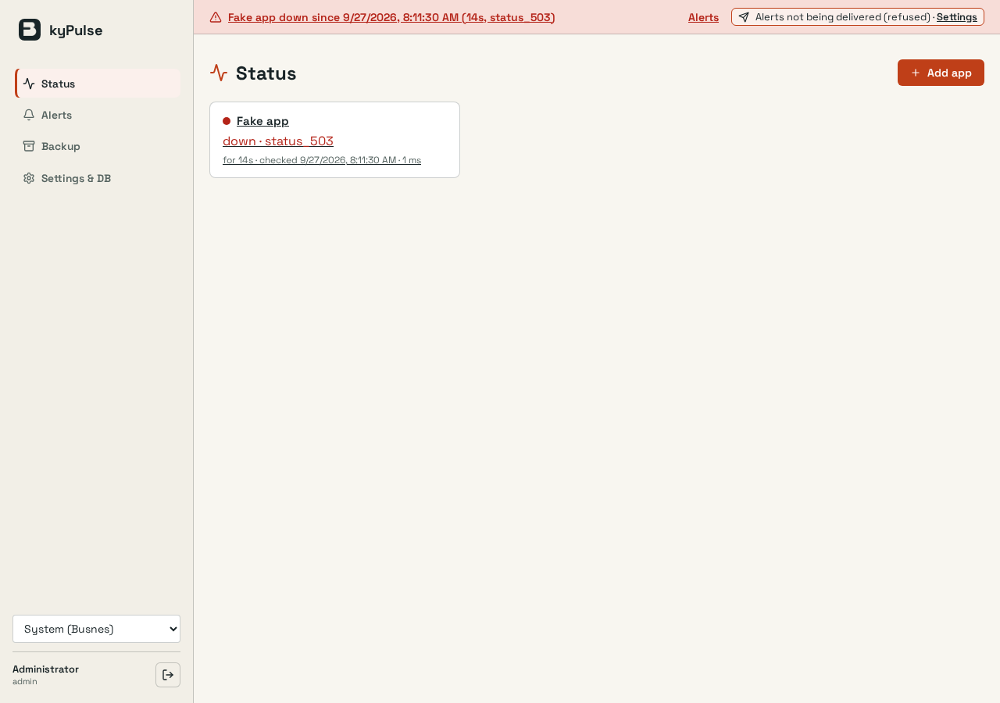
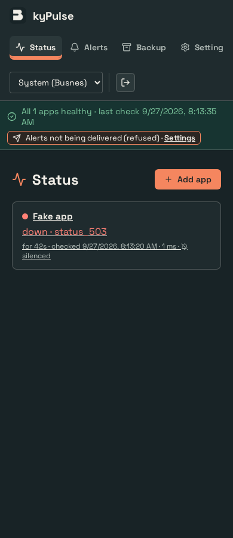
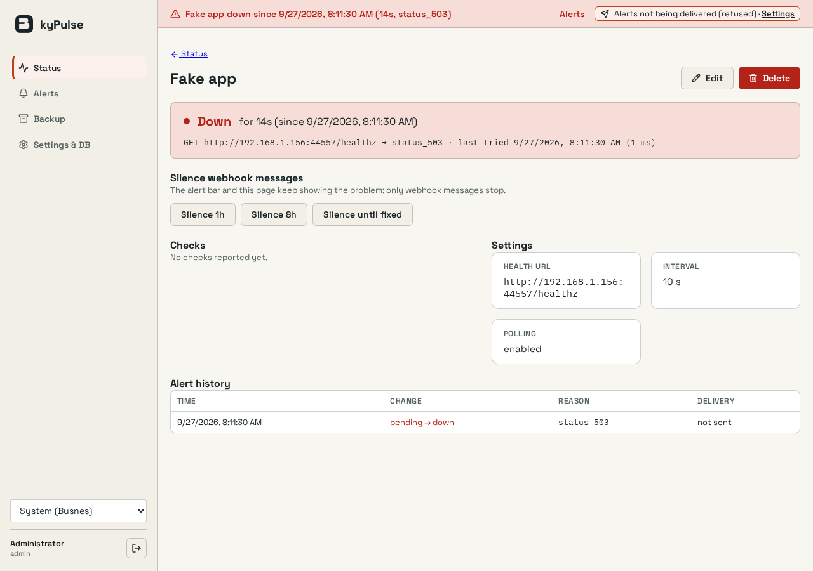
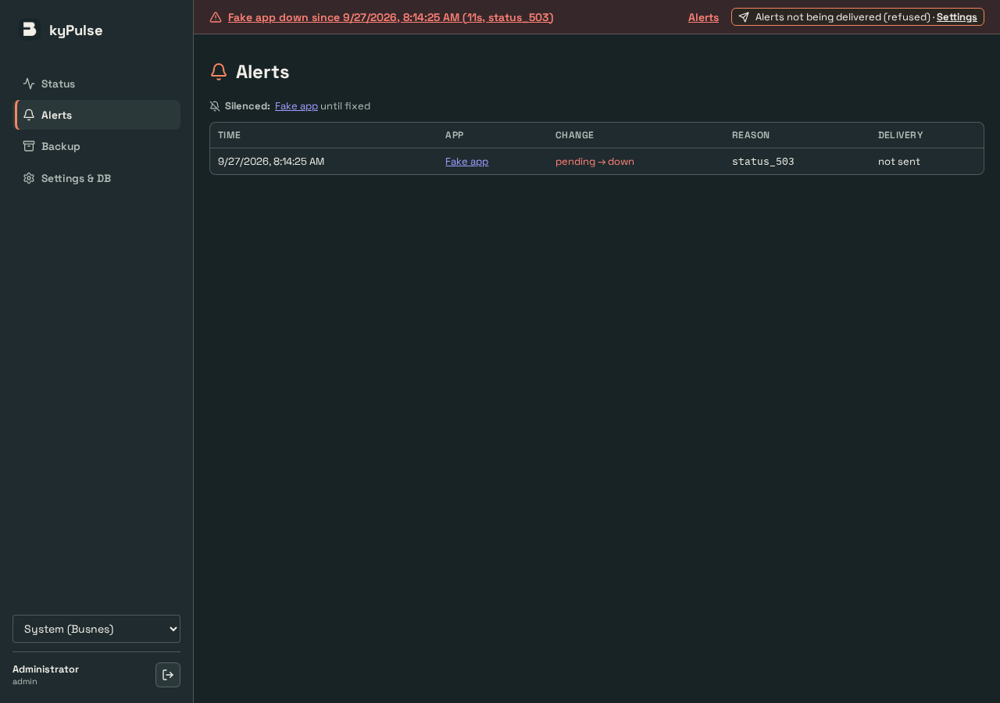

# UI verification

kyPulse's own screens (step 2c): alert bar, Status, Alerts, app detail, webhook form.

## Capture conditions

Captured by `web/browser/monitor.spec.mjs` against the real Go server with disposable SQLite
data, production CSP and real login, at 1280×900 and 390×900 in Busnes Light and Dark. The
watched app is a fake `ky.health/1` server on the runner's LAN address; the webhook is the
same server answering 500.

## Checks

`npm test` (vitest: router, monitor helpers and client, AlertBar, Status, Alerts, AppDetail,
WebhookForm, KyYardCard, Backup, ChangePassword) and `npm run test:browser` (shell spec plus
the monitor spec: empty install, add app, down after three polls, red bar linking to the
detail page, checks, silence until fixed, Alerts table and silences, webhook saved, test send
failing, "Alerts not being delivered", recovery to green with the silence cleared, delete back
to Status, no horizontal overflow). Viewer-role rendering of Status, Alerts and the detail page
is covered by component tests; the `#/backup` redirect and the Settings webhook gate rely on
the server's 403s (`internal/api` authorisation tests).

KyYard (pairing card, stale alert-bar line, container facts, suggestion prefill) is covered by
component tests only (`KyYardCard.test.tsx`, `AlertBar.test.tsx`, `AppDetail.test.tsx`,
`Status.test.tsx`); there is no browser run against a real or fake KyYard in CI, so no
screenshots below include it.

## Screenshots

| | |
| --- | --- |
|  |  |
|  |  |

## Reproduce

Build the frontend, run `go build -o .browser/server ./cmd/server` at the repo root, then
`cd web && npx playwright install chromium && npm run test:browser`. The monitor spec skips on
a machine with no private IPv4 interface.
